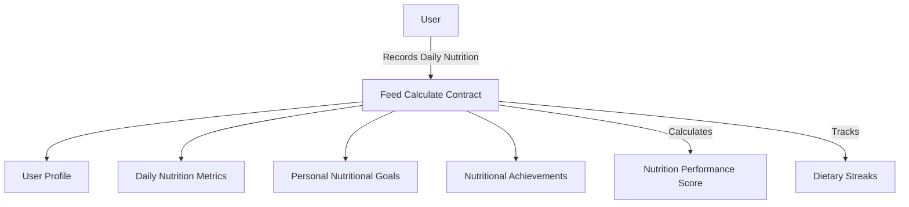

# Feed Calculate

A decentralized nutrition tracking platform that empowers users to monitor their dietary metrics, set nutritional goals, and earn rewards while maintaining complete data sovereignty.

## Overview

Feed Calculate is a blockchain-based nutrition monitoring system that helps users track three key nutritional metrics:
- Meal composition
- Caloric intake
- Nutritional performance

The platform features:
- Personal nutrition goal setting
- Daily meal logging
- Achievement tracking
- Performance scoring
- Privacy-focused data management
- Continuous nutritional streak tracking

## Architecture

The Feed Calculate system is built around a core smart contract that manages user nutritional data, goals, and achievements.



The contract implements several key data structures:
- `users`: Stores user profiles and nutrition performance scores
- `daily-metrics`: Records daily nutritional activities
- `user-goals`: Maintains personal nutritional targets
- `user-achievements`: Tracks earned nutritional achievements
- `achievement-definitions`: Defines available nutritional badges and requirements

## Contract Documentation

### Core Functionality

#### User Management
- User profiles are automatically created on first interaction
- Tracks join date, wellness score, and activity streaks
- Privacy-preserving design with principal-based identification

#### Metrics Tracking
- Records daily sleep hours (0-24)
- Monitors water intake in milliliters (0-10000)
- Tracks meditation minutes (0-1440)
- Prevents overwriting of same-day entries

#### Achievement System
Three categories of achievements:
1. Streak-based (7, 30, 100 days)
2. Wellness score milestones (50, 75, 90 points)
3. Goal completion tracking

## Getting Started

### Prerequisites
- Clarinet
- Stacks wallet for testing

### Basic Usage

1. Set wellness goals:
```clarity
(contract-call? .glownest-tracker set-wellness-goals 
    u8  ;; sleep hours goal
    u2000  ;; water ml goal
    u20)  ;; meditation minutes goal
```

2. Record daily metrics:
```clarity
(contract-call? .glownest-tracker record-daily-metrics 
    u7  ;; sleep hours
    u1500  ;; water ml
    u15)  ;; meditation minutes
```

## Function Reference

### Public Functions

#### `set-wellness-goals`
Sets personal wellness targets
```clarity
(set-wellness-goals sleep-hours-goal water-ml-goal meditation-minutes-goal)
```

#### `record-daily-metrics`
Records all daily wellness metrics
```clarity
(record-daily-metrics sleep-hours water-ml meditation-minutes)
```

#### `update-single-metric`
Updates a single metric value
```clarity
(update-single-metric metric-type value)
```

### Read-Only Functions

#### `get-user-profile`
```clarity
(get-user-profile user) ;; Returns user's profile information
```

#### `get-daily-metrics`
```clarity
(get-daily-metrics user date) ;; Returns metrics for specific date
```

#### `get-user-achievements`
```clarity
(get-user-achievements user) ;; Returns list of earned achievements
```

## Development

### Testing
1. Clone the repository
2. Install Clarinet
3. Run tests:
```bash
clarinet test
```

### Local Development
1. Start Clarinet console:
```bash
clarinet console
```
2. Deploy contract:
```clarity
(contract-call? .glownest-tracker initialize-achievements)
```

## Security Considerations

### Data Privacy
- All data is associated with user principals
- No direct access to other users' data
- Immutable history of wellness records

### Limitations
- Daily metrics can only be recorded once per day
- Metric values have reasonable upper limits
- Achievement badges cannot be revoked once earned

### Best Practices
- Always validate metric values before submission
- Regular backups of achievement records
- Monitor wellness score calculations for accuracy